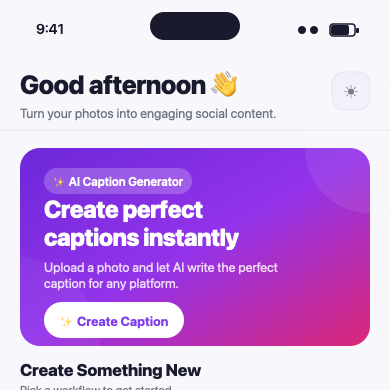
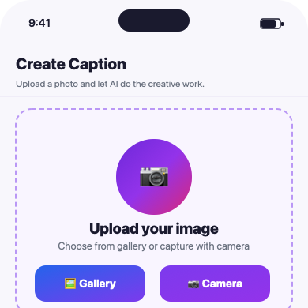
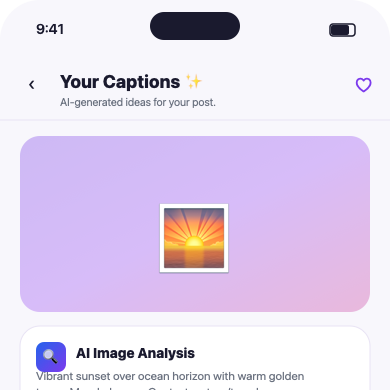
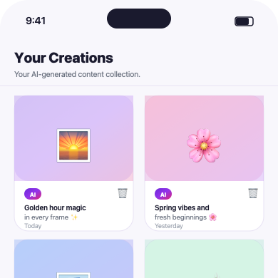
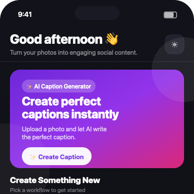
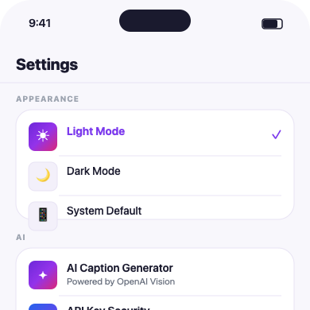

# Image2Caption

> **AI-powered social media caption and hashtag generator for Flutter.**
> Upload a photo, choose your platform and tone, and get three polished caption suggestions with matching hashtags — generated by OpenAI Vision in seconds.

---

## Screenshots

<table>
  <tr>
    <td align="center"><b>Home</b></td>
    <td align="center"><b>Create</b></td>
    <td align="center"><b>Results</b></td>
  </tr>
  <tr>
    <td></td>
    <td></td>
    <td></td>
  </tr>
  <tr>
    <td align="center"><b>History</b></td>
    <td align="center"><b>Dark Mode</b></td>
    <td align="center"><b>Settings</b></td>
  </tr>
  <tr>
    <td></td>
    <td></td>
    <td></td>
  </tr>
</table>

---

## Features

| Feature | Detail |
|---|---|
| 📸 **Image Input** | Pick from Gallery or capture with Camera |
| 🤖 **AI Analysis** | OpenAI Vision analyzes image content, mood, and context |
| ✍️ **3 Caption Suggestions** | Tap to select, inline edit, copy, or share |
| #️⃣ **Smart Hashtags** | Grouped by Trending / Niche with Copy All |
| 🎨 **Tone Control** | Auto · Funny · Professional · Romantic · Viral |
| 📱 **Platform Targeting** | Instagram · LinkedIn · Twitter |
| 🌐 **Language** | English · Hindi |
| 🗃️ **Local History** | SQLite-backed grid gallery with AI badge |
| ❤️ **Favorites** | Star any result for quick access |
| 🌙 **Dark Mode** | Full light / dark / system theme support |

---

## Getting Started

### 1. Install dependencies

```bash
flutter pub get
```

### 2. Set your OpenAI API key

**Option A — `.env` file** *(recommended for local dev)*

Create `assets/.env`:

```
OPENAI_API_KEY=sk-...your-key-here...
```

**Option B — `--dart-define`**

```bash
flutter run --dart-define=OPENAI_API_KEY=sk-...your-key-here...
```

> ⚠️ Never commit your API key. `assets/.env` is in `.gitignore`.

### 3. Run the app

```bash
flutter run
```

---

## Project Structure

```
lib/
├── main.dart                   # App entry, API key loading, theme wiring
├── theme/
│   ├── app_colors.dart         # Brand palette (purple → violet → pink)
│   ├── app_dimensions.dart     # Spacing, radius, shadows, gradients
│   └── app_theme.dart          # Light + dark ThemeData
├── models/
│   ├── caption_record.dart     # DB model, enums (tone, platform, language)
│   └── caption_result.dart     # AI response model
├── providers/
│   └── caption_provider.dart   # State management (Provider)
├── services/
│   ├── ai_caption_service.dart # OpenAI Vision API integration
│   └── image_picker_service.dart
├── database/
│   └── app_database.dart       # SQLite via sqflite
├── screens/
│   ├── app_shell.dart          # Bottom navigation shell + ShellNavigator
│   ├── home_screen.dart        # Dashboard, hero card, recent creations
│   ├── create_screen.dart      # Image upload, options, generate CTA
│   ├── result_screen.dart      # Caption cards, hashtags, share/copy
│   ├── history_screen.dart     # 2-column grid gallery
│   ├── history_detail_screen.dart
│   └── settings_screen.dart
└── widgets/
    ├── app_components.dart     # AppCard, SectionHeader, HashtagChip, EmptyStateWidget
    ├── app_gradient_button.dart
    └── loading_ai_widget.dart  # Animated 4-step AI loading overlay
```

---

## Security Note

Your OpenAI API key is **never hardcoded** in source code. It is loaded at runtime from `assets/.env` or `--dart-define`. For a production deployment, proxy all OpenAI requests through your own backend so the key is never shipped inside the client binary.

---

## Tech Stack

- **Flutter** (Material 3, Dart 3)
- **OpenAI GPT-4o Vision** — image analysis and caption generation
- **Provider** — state management
- **sqflite** — local history database
- **share_plus** — native share sheet
- **image_picker** — gallery + camera access
- **flutter_dotenv** — `.env` loading

---

## Author

**Neha Thakur**

[](https://github.com/nehathakur834)
[](https://linkedin.com/in/Neha%20Thakur)
[](https://nehathakurportfolio.netlify.app)
